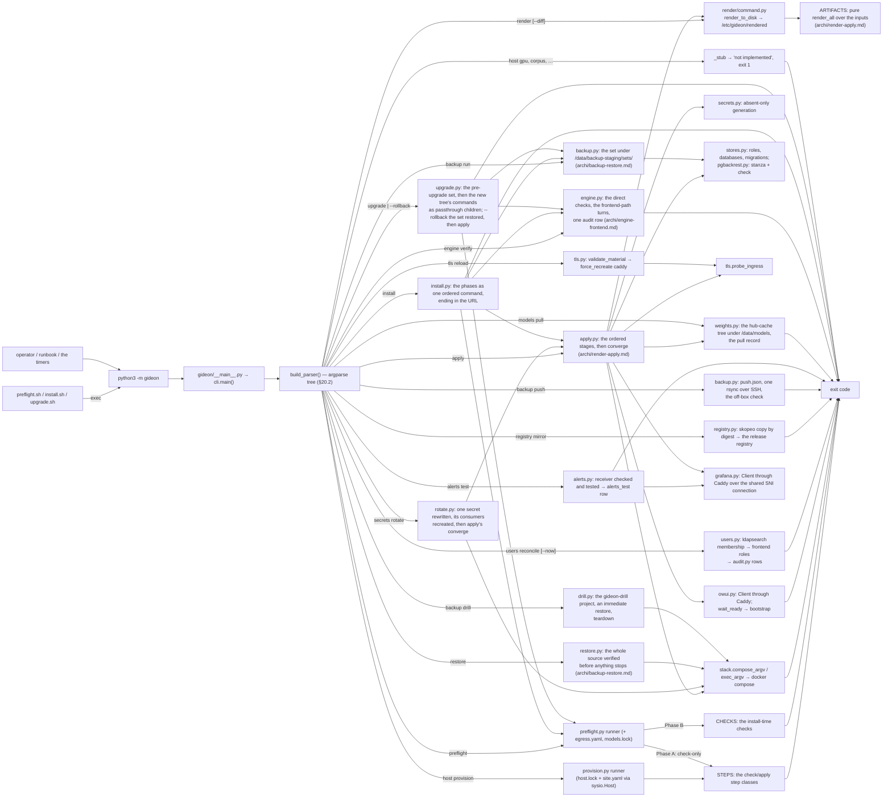

# GIDEON Architecture Documentation

## 1. How to Read This Document

This document records **how the code is built** — structure, conventions, commands — for anyone (human or agent) about to implement in this repo, as the code exists, not as the destination. For *what* is built and *why*, the authorities are, in precedence order: `.scratch/greenfield-spec/spec.md` (the build spec), the ticket Answers under `.scratch/greenfield-spec/issues/`, `CONTEXT.md` (the vocabulary; development repository), and [`docs/adr/`](adr/) (the decision records). `§n` references point into the spec; this document never restates a spec decision it can cite.

A plan reads the map whole. The leaves under `docs/archi/` (one per subsystem, listed in §2) carry a subsystem's commands, constants, paths, and tests; a plan names the leaves a ticket touches, implement reads the plan plus those, and §8's table names every command's leaf. [`docs/ARCHI-rules.md`](ARCHI-rules.md) holds the leaf template, the budgets `tests/test_archi_budget.py` enforces, and the compaction rule; a release updates it on a structural change.

## 2. Overview

GIDEON is a fully local legal AI system for federal defender offices: corpus-grounded legal research with computed, verified citations beside a general-purpose assistant, on one box the office controls (spec §0). The deployed product is a Docker Compose suite (§20.1); **the code in this repo is the one Python package `gideon`** that provisions, configures, operates, and (in later slices) serves it.

**Project type: CLI tool**, growing into a containerized service suite. The package is the product CLI `python3 -m gideon` (§20.2), the surface `tests/test_cli_surface.py` names, its later-slice groups still stubs. Slice 0 is complete at `v0.1.0` (§22); every later slice ends in its minor tag. Landed behaviour is all bare-host (`gideon/host/`, §9), each subsystem detailed in its leaf:

| Leaf | Covers | Commands and tools |
|---|---|---|
| [`archi/host.md`](archi/host.md) | the host platform: the site model and schema, provision and its steps, the image store's home, preflight and its checks, the three locks and the profile's memory table, host state, the no-GPU and build-box modes, the office clock, the CI runner step | `host provision`, `preflight` |
| [`archi/render-apply.md`](archi/render-apply.md) | render and apply: the rendered tree, secrets and their rotation, the release constants, the search rig's rendered files, the memory limits, the weights tree | `render`, `apply`, `secrets rotate`, `models pull` |
| [`archi/engine-frontend.md`](archi/engine-frontend.md) | the engine and the frontend's runtime: the engine service and the frontend's connection, the two model records, the frontend client and the managed turn, the two Filters and the trip's row, `engine verify` and its sample | `engine verify`, the frontend client |
| [`archi/backup-restore.md`](archi/backup-restore.md) | the backup set and its commands, restore, install, upgrade and rollback | `backup run\|push\|drill`, `restore`, `install`, `upgrade` |
| [`archi/stack.md`](archi/stack.md) | ingress and TLS, the registry mirror, observability and alerting, reconcile and the audit writer | `tls reload`, `registry mirror`, `alerts test`, `users reconcile` |
| [`archi/tools.md`](archi/tools.md) | the pin watch and the research notes' pin bindings, the build tool, the acceptance harness and its full-restore form, the turn harness and its browser mode, the gate, and the development repository's cycles record, tracker board, and release git tail; their interpreters and footprints | `tools.pinwatch` and its `.notes`, `.hub`, `.bumped`; `tools.imagebuild`, `tools.acceptance`, `tools.turns`; the development repository's `tools.cycles`, `tools.tracker` |
| [`archi/tests.md`](archi/tests.md) | the repo-wide tripwires, the per-command pattern, the contract tier | `tests/`, `tests/contract/` |

The Compose project holds the services `render/compose.service_names` enumerates, at the digests `images.lock` pins: Caddy, the HTTPS-only ingress (§1.6), also serving `/grafana/`; PostgreSQL with pgBackRest, the record (§7.2, §19.1); Open WebUI, the frontend (§4), configured from env and the apply manifest only; the engine `gideon-generator` (a GPU host only, §5) and SearXNG, General's metasearch (while `web.search` is on, §15), each as shipped on the Compose network alone; and the observability tier (§19.5) — Prometheus on loopback only, Grafana behind the ingress, the exporters unpublished. Everything sits behind the injectable system-I/O seam `gideon/host/sysio.py`.

## 3. Technology Stack

| Component | Version | Where pinned |
|---|---|---|
| Python | ≥ 3.12 floor (Ubuntu 24.04 fallback, spec §1.2); the box runs the LTS `host.lock` names, whose Python is **3.14** | `pyproject.toml` `requires-python`; CI runs 3.14 |
| Build backend | setuptools ≥ 77 | `pyproject.toml` |
| ruff, mypy, pytest, PyYAML, Playwright — the dev and CI toolchain, never the product's | five exact pins; ruff and mypy at the 3.12 floor with `check_untyped_defs` (`pyproject.toml`); PyYAML stands in for the box's `python3-yaml`; Playwright bundles the Chromium build `tools/turns/chromium.py` names — the headless shell alone on the box, the package in CI for mypy only and in the dev venv, never the box's system Python; a bump is Dependabot's proposal (§6), never the pin watch's | `requirements-dev.txt`; the two copies (`pin-watch.yml`'s install line, the Playwright constant) held equal by `tests/test_toolchain_pins.py` |

**Built images**: `images/<name>/Dockerfile` is argument-driven (`ARG BASE` before `FROM`, one `ARG` per build input) and embeds no version; the values live in `images.lock`'s built pin ([`archi/host.md`](archi/host.md)) and reach the build from `python3 -m tools.imagebuild` on the box.

**Runtime dependencies: none.** The bare-host path (`gideon host`, the entry chain) imports only the standard library and `yaml` (`python3-yaml`, present on every Ubuntu Server — §1.5, §2.3; **never PyPI** on a box). Commands outside the host subtree grow heavier dependencies later *inside their handlers* (§9), because the rest of the CLI runs from the release's pinned container image, not from a pip install.

**Tooling on the box** (`tools/`): the interpreters, imports, and footprints of every tool are in [`archi/tools.md`](archi/tools.md); nothing there is the product.

## 4. Project Structure

The development repository's tree; §16 names what the export omits.

```
GIDEON/
├── gideon/                  # the one Python package
│   ├── __init__.py          # docstring + __version__ (single-sourced, §11)
│   ├── __main__.py          # python3 -m gideon → sys.exit(main())
│   ├── cli.py               # build_parser() + main(): the whole §20.2 surface
│   └── host/                # bare-host subtree: stdlib + yaml ONLY (§9); §8's table names each command's leaf
│       ├── cli.py · sysio.py · report.py · stages.py   # the handlers, the injectable Host seam, the refusal and row shapes, run_stage (§8, §10, §14)
│       ├── lock.py · images.py · models.py · egress.py · site.py · site_schema.py · nogpu.py   # the committed-artifact loaders, the schema emitter, the no-GPU marker
│       ├── provision.py + steps/ · preflight.py + checks/   # the §1.5 runners and the STEPS and CHECKS registries
│       ├── render/          # the §3.5 pure render core: the ARTIFACTS registry, one module per artifact family, consumers, command
│       ├── apply.py · rotate.py · secrets.py · weights.py · engine.py · enginesample.py   # apply and its converge; secrets rotate; the secret registry; the weights tree; engine verify and its sample
│       ├── owui.py · owuiturn.py · grafana.py · ingress.py   # the frontend client and its managed turn, the Grafana client, the shared SNI connection
│       ├── stores.py · audit.py · users.py · ldap.py · alerts.py   # Postgres roles and migrations, the audit writer, reconcile and its directory reads, alerts test
│       ├── stack.py · tls.py · registry.py · pgbackrest.py · sshtarget.py   # argv builders and probes
│       └── install.py · upgrade.py · backupset.py · backup.py · backuplock.py · restore.py · drill.py   # install; the two-tree upgrade and its rollback; the set model, the four backup commands, and their lock
├── images/postgres/Dockerfile   # the one built image (base + pgbackrest; no pin in the file)
├── compose/                 # templates by service: caddy/, open-webui/ (permissions.yaml, general.yaml, functions/ — the two Filters, release content
│                            #   never imported as a gideon module), postgres/, systemd/, prometheus/, blackbox/, grafana/
├── tests/                   # unittest-style classes run by pytest (§15); one test_<area>.py per module or command, plus:
│   ├── fixtures/            # site/ (refusals); render/<example|second-office|no-gpu>/ (byte-stable renders); host/ (the recorded box, the runner's settings)
│   ├── regenerate_render_fixtures.py   # rewrites fixtures/render deliberately (the drift test names it)
│   └── contract/            # self-hosted-only modules, no test_ prefix, each with its throwaway stack's files beside it (archi/tests.md)
├── tools/                   # repository tooling, never the product (not in the release image); stdlib + gideon.host only (archi/tools.md)
│   ├── pinwatch/ · imagebuild/ · acceptance/ · turns/ · redact/   # the pin watch (hosted CI); the build tool, the clean-VM harness, the turn harness's two drivers, the evidence redaction (the box)
│   ├── ownership.py         # the sudo hand-back (--out and the bytecode caches) the two harnesses share
│   └── gate.py · cycles.py · tracker.py · exportboundary.py   # the gate, the cycles record and tracker board (development repository), the export list — the dev venv
├── bin/                     # trip, the cycle launcher; release-git, worktree-claim, worktree-remove, the guard's git as one plain command each; release-export, the public export (archi/tools.md); excluded from the export
├── preflight.sh / install.sh / upgrade.sh   # thin entrypoints over the CLI (§2.2)
├── config/                  # site.example.yaml (Appendix C, authoritative); site.schema.json (generated, drift-tested); egress.yaml (the §2.3 allowlist, by group)
├── images.lock · host.lock · models.lock  # the §2.2 pins (below)
├── requirements-dev.txt     # the dev and CI toolchain's five pins — never the product's (§6)
├── migrations/              # forward-only SQL (ADR-0005), NNNN_<name>.sql in order; the runner owns schema_migrations
├── eval/                    # reference/ (empty skeleton, §18.5); seed/prototype-qa/ (frozen harvest tooling, ruff-excluded, do not modify);
│                            #   seed/guardrails/ and seed/general/ (the two Filters' seeds, General's load and smoke sets — superseded, never edited); engine-verify/ (the §6.7 sample, release content)
├── .claude/ · skills-lock.json   # the shared agent tooling (docs/agents/tooling.md); the Matt Pocock skills' lock
├── .github/                 # workflows/ (ci.yml, pin-watch.yml, acceptance.yml — §6); the contributor's issue and pull-request templates; dependabot.yml (§6)
├── docs/                    # ARCHI.md (the map), archi/ (the leaves), box-ledger.md (the shared box), adr/, agents/, runbooks/ (the operator runbooks), handoffs/, research/, teach/,
│                            #   release-notes/ (§11), the TRIP docs (1-plans … 6-memo; 4-unit-tests/TESTING.md)
├── .scratch/                # the work tracker — committed and AUTHORITATIVE despite the name
└── CONTEXT.md · README.md · CLAUDE.md · CONTRIBUTING.md · SECURITY.md · CHANGELOG.md · LICENSE · THIRD_PARTY_LICENSES.md · pyproject.toml
```

**Lock files** (repo root): `host.lock`, `images.lock`, `models.lock` — what each pins, the two image-pin kinds, and the pin watch's patch rule are in [`archi/host.md`](archi/host.md); no pin value is restated here or in any test module (§15).

**On-box paths**: `compose.yaml` is **never committed** — it is rendered into `/etc/gideon/rendered/` ([`archi/render-apply.md`](archi/render-apply.md)). Provision-owned data roots: `/data/backup-staging/` (`pgbackrest/` the repository; `sets/<label>/` one set per run — `manifest.json`, `secrets.tar.age`, `files/<root>/`; `push.json` the last push's coverage record; `rollback.json` a rollback in progress), `/data/drill/` (the throwaway drill project), `/data/acceptance/` (the acceptance harness's run directories, used on the build box alone), `/data/observability/{prometheus,grafana}/` (derived state, outside the backup set), and **`/data/models/`**, the weights tree (§5.4; derived state outside every set), written only by `models pull` and apply's `models` stage — the Hugging Face hub-cache layout under `hub/`, root-owned with 0444 blobs, and `gideon/pulls.yaml`, the pull record. `/var/lib/docker/containerd/` is the shared daemon's image store — containerd's root, a setting the `docker-engine` step writes, on the volume the runbook sizes for Docker (ADR-0040; [`archi/host.md`](archi/host.md)) — derived state outside every set, both projects' images and the build cache. Host state, not configuration, never in a set: `/etc/gideon/no-gpu`, written once by `host provision --no-gpu`, `/etc/gideon/build-box`, written once by `host provision --build-box`, and `/etc/gideon/backup_age_identity`, the box's own backup identity (ADR-0042). Tool footprints: [`archi/tools.md`](archi/tools.md). `/opt/gideon` is the install home, TNMD's box's too (§1.9); a unit's `WorkingDirectory` is apply's checkout. Reserved: `corpus/lockfiles/` and `courts.yaml` arrive with their slices.

## 5. Core Architecture Principles

1. **One CLI, thin entrypoints** (§2.2, §20.2): all logic lives in `python3 -m gideon`; `preflight.sh` / `install.sh` / `upgrade.sh` are three-line `exec` wrappers. New operator surface = a new subcommand, never a new script.
2. **The bare-host seam is load-bearing** (§1.5, §2.3): `gideon host provision` must run on a fresh Ubuntu Server install before anything is installed. The seam is enforced by CI, not convention (§9).
3. **Stubs refuse loudly**: every unimplemented command prints `gideon <command path>: not implemented` to stderr and exits non-zero. Nothing pretends to work; the surfaces that succeed today are §8's table (`host gpu` and the later-slice groups still refuse).
4. **Behaviour lands only under a TRIP plan, in slice order** (§22): slice 0 platform → 1 General → 2 eval harness → 3 corpus machinery → 4 Research go-live → …. The fog list in `.scratch/greenfield-spec/assets/24-trip-init-handoff.md` is a do-not-build list.
5. **The spec's cross-cutting rules bind all code** (§0.2): deterministic code or nothing (ADR-0006); citations computed, never generated (ADR-0019); no green state (ADR-0020); the record is Postgres + CAS, indexes are derived (ADR-0012); nothing edited in place — supersede, never overwrite; no `.env`, secrets are files (§1.7); no site key for behaviour (ADR-0028); OWUI never rebranded (ADR-0003).
6. **Never re-litigate a map decision.** A decision that implementation proves wrong is surfaced on the tracker as a supersession, never improvised around.

## 6. Build System & Toolchain

There is no build step: the package runs in place (`pythonpath = ["."]`) — from a checkout, `python3 -m gideon --help` works with zero installs on any Ubuntu ≥ 24.04. Packaging metadata (`pyproject.toml`, setuptools) exists chiefly to single-source the version and record the package set.

**The gate** (before any commit; CI's `Gate` step, with `--all`): `python3 -m tools.gate [--all] [TEST_PATH ...]` — ruff, mypy, then `pytest -x`, stopping at the first failure ([`archi/tools.md`](archi/tools.md)).

The tools live in an untracked project venv — `python3 -m venv .venv && .venv/bin/pip install -r requirements-dev.txt`; CI's `checks` job installs from the same file, and `tests/test_toolchain_pins.py` holds its two copies to it ([`archi/tests.md`](archi/tests.md)).

**CI** (trunk-based, §2.1: `main` always deployable, short-lived feature branches, bump pull requests merged by a human and never auto-merged, every slice a tagged release):

| Job | Trigger, runner | Does |
|---|---|---|
| `checks` (`ci.yml`) | push to `main` + PRs; **hosted** `ubuntu-latest` by design (§2.6), Python 3.14 | pinned tool installs → lint → typecheck → the host-import-boundary test as its own named step → full pytest |
| `mirror-images` (`ci.yml`) | push to `main` only, after `checks`, **never pull-request code**; the box's self-hosted runner (§1.8) | `registry mirror --to 127.0.0.1:5000` with the system Python, then `python3 -m unittest tests/contract/built_images.py` — a lock naming a digest nobody built is red on the box the same day |
| `frontend-contract` (`ci.yml`) | after `mirror-images`, same runner | `python3 -m unittest tests/contract/owui_apply_manifest.py`: a throwaway Postgres + frontend pair on loopback proves the apply manifest is desired state ([`archi/tests.md`](archi/tests.md)) |
| `search-sentinel` (`ci.yml`) | after `frontend-contract`, same runner, port, and concurrency group | `python3 -m unittest tests/contract/search_sentinel.py`: a throwaway search stack drives one General search carrying a synthetic marker and finds it in no log the stack writes ([`archi/tests.md`](archi/tests.md)) |
| `acceptance` (`acceptance.yml`) | every pushed `v*.*.0` tag, same runner; `concurrency: acceptance`; `workflow_dispatch` re-makes a tag's record | `registry mirror`, then `sudo python3 -m tools.acceptance "$ACCEPTANCE_REF" --out acceptance-out`, then the same with `--full-restore --out acceptance-restore-out`, through the runner's one sudoers line, the transcripts uploaded even on failure — the standing record of §22.1's proof (ADR-0035) |
| `watch` (`pin-watch.yml`) | Monday 06:17 CST on `ubuntu-latest`; `workflow_dispatch` takes `dry_run` | an installation token minted per run from the org's App, the App's bot as git identity, then `python3 -m tools.pinwatch` with the token as `GH_TOKEN` — what makes the bump PRs trigger `checks` (PRs from `GITHUB_TOKEN` never do) |

The workflows use the current action majors (node24 runtime, whose runner floor the pinned `gh_runner` clears). Dependabot (`.github/dependabot.yml`, export-ignored) proposes the action majors, grouped, and the dev toolchain's pins every Monday before the review; a human merges, completing on the branch a bump whose copy `tests/test_toolchain_pins.py` holds equal, and an action major whose runtime needs a newer runner waits for the pin watch's `host.gh_runner` pull request. No workflow test.

## 7. Configuration

- **Development**: everything in `pyproject.toml` (ruff/mypy/pytest sections). No other dotfile config.
- **Product runtime** (§3): one file, `/etc/gideon/site.yaml` — the office's facts and policies, never product behaviour (ADR-0028). [`config/site.example.yaml`](../config/site.example.yaml) is authoritative for keys, defaults, and allowed values (Appendix C) and ships in every release. No secret and no path lives in it. **No `.env` file exists, ever**, and no environment variable configures the CLI.
- **The site model, host state, and the other committed artifacts** — [`archi/host.md`](archi/host.md): `FIELD_REGISTRY` and `load_site()` (`gideon/host/site.py`) own the fully-defaulted site configuration and its schema; the no-GPU and build-box markers (`gideon/host/nogpu.py`) and the plain-registry rule (`images.is_plain_registry`) are host state, not configuration; `config/egress.yaml`, `images.lock`, and `models.lock` carry the allowlists, build inputs, hardware profiles, and model pins.
- **Secrets as files, the release constants, and `/etc/gideon/rendered/`** — [`archi/render-apply.md`](archi/render-apply.md): generated and supplied secrets are file-borne (`gideon/host/secrets.py`), never CLI configuration; a release artifact that is not a site key is a constant in the module the leaf names; the `ARTIFACTS` registry (`gideon/host/render/`) emits the rendered tree, `manifest.yaml`, and the verified `applied.yaml` record.

## 8. Command Structure

One `argparse` tree in `gideon/cli.py` (`build_parser()`), grouped exactly as spec §20.2 plus `backup drill` (the [22] Answer; §20.2's omission is a recorded spec bug). Groups with subcommands mark them `required=True`; `--version` prints `gideon {__version__}`.

The dispatch pattern — every command follows it:

```
subparser.set_defaults(handler=<callable>, command_path="<group sub>")
main(): args.handler(args) -> int
```

- `handler` receives the parsed `argparse.Namespace` and returns an exit code; `main()` returns it, `__main__.py` passes it to `sys.exit()`. `command_path` is the command name used in refusals (later in audit rows).
- Host-path commands dispatch to `gideon.host.cli`, `run_<command>` → the module of the same name; the ordered commands sit behind `_guarded`, the command boundary that turns any unexpected exception into one refusal line; `run_gpu` and the later-slice groups use the shared `_stub`. Every real command takes injectable `host=`/path keyword arguments (and `client_factory=` where it talks to the frontend) so tests run it in-process over a fake `Host`.
- **Three registries, one shape**: `STEPS` (`host/steps/__init__.py`), `CHECKS` (`host/checks/__init__.py`), and `ARTIFACTS` (`host/render/__init__.py`) are ordered lists of *instances*; a new step, check, or artifact is an instance appended to its registry, and only the runners enumerate them.
- **Ordered commands print rows**: each stage is one `StageResult` row on stdout (`stages.run_stage`), the run stops at the first refusal, and exit 0 iff every row is ok. Each leaf names its commands' stages and the invariants they carry; the stage bodies are in the module and their argv, flags, and mechanics in its test ([`archi/tests.md`](archi/tests.md)).

Every command's stages, invariants, argv, and release constants live in its leaf, one row per leaf, each command with its module:

| Command (module) | Leaf |
|---|---|
| `host provision` (`host/provision.py`) · `preflight` (`host/preflight.py`) | [`archi/host.md`](archi/host.md) |
| `render [--diff]` (`host/render/`) · `apply` (`host/apply.py`) · `secrets rotate <name>` (`host/rotate.py`) · `models pull` (`host/weights.py`) | [`archi/render-apply.md`](archi/render-apply.md) |
| `engine verify` (`host/engine.py`) · the frontend client (`host/owui.py`, `host/owuiturn.py`) · the two Filters (`compose/open-webui/functions/`) | [`archi/engine-frontend.md`](archi/engine-frontend.md) |
| `backup run` and `backup push` (`host/backup.py`) · `backup drill` (`host/drill.py`) · `restore` (`host/restore.py`) · `install` (`host/install.py`) · `upgrade <tag>` and `upgrade --rollback` (`host/upgrade.py`) | [`archi/backup-restore.md`](archi/backup-restore.md) |
| `alerts test` (`host/alerts.py`) · `users reconcile [--now]` (`host/users.py`) · `tls reload` (`host/tls.py`) · `registry mirror [--to]` (`host/registry.py`) | [`archi/stack.md`](archi/stack.md) |
| `python3 -m tools.gate [TEST_PATH ...]` (`tools/gate.py`) · `python3 -m tools.imagebuild` (`tools/imagebuild/`) · `sudo python3 -m tools.acceptance` (`tools/acceptance/`) · `sudo python3 -m tools.turns [--browser]` (`tools/turns/`) · `python3 -m tools.pinwatch` and its `.notes`, `.hub`, and `.bumped` (`tools/pinwatch/`) · `python3 -m tools.cycles [--write] [--latest [--session <prefix>]]` (`tools/cycles.py`) · `python3 -m tools.tracker [--check] [--strict]` (`tools/tracker.py`) · `python3 -m tools.redact --site <file>` (`tools/redact/`) · `bin/trip [work\|personal] [1-4] plan\|implement\|release\|cycle` (`bin/trip`) · `bin/release-git <message file>` (`bin/release-git`) · `bin/worktree-claim <slug> [feat\|fix\|hotfix]` (`bin/worktree-claim`) · `bin/worktree-remove <slug>` (`bin/worktree-remove`) · `bin/release-export <tag>` (`bin/release-export`) (cycles, tracker, `bin/`: development repository) | [`archi/tools.md`](archi/tools.md) |

**When a command gains behaviour**: replace its `handler` with a real callable (a new module under `gideon/`, or under `gideon/host/` iff it must run bare-host), keep `command_path` on the namespace and the return-int contract, cite the spec section in the help string (`help="… (§n)"`), add the command to its leaf's row above, and shrink `tests/test_cli_surface.py`'s `STUBS` list in the same change (`TOP_LEVEL` names the full surface).

## 9. The Bare-Host Import Boundary

The seam that makes §1.9 step 3 possible: `sudo python3 -m gideon host provision` runs on a bare Ubuntu Server install where only the stdlib and `python3-yaml` exist. `tests/test_host_import_boundary.py` enforces it **at the AST level** (nothing is imported to be checked), with two rules:

1. **Entry chain** (`gideon/__init__.py`, `__main__.py`, `cli.py`): *module-level* imports resolve only to the stdlib, `yaml`, or the checked set itself. Function-level imports are exempt — the documented mechanism for non-host commands to grow heavy dependencies later.
2. **Host subtree** (`gideon/host/**`): **every** import, at any depth, resolves to the stdlib, `yaml`, or the checked set. No exemptions.

CI runs this test as its own named step so a violation is legible in the Actions UI. For implementers: never add a module-level third-party import to the entry chain; never import anything heavier than `yaml` anywhere under `gideon/host/`; anything the host path and the rest of the product both need must itself live in the checked set.

## 10. Input/Output Handling & Exit Codes

- **stdout** is command output: help, every command's per-item lines and stage rows (**including failing rows**, which carry their fix), its next-step lines, a child tree's rows passed through during an upgrade, and the print-once secret lines; a secret artifact's diff never shows its contents. **stderr** is pre-run refusals and errors: root required, the loaders' refusals, foreign rendered files, template loading, and the command boundary's `internal error` line. `gideon/host/report.py` holds the one refusal shape — `gideon <command>: <problem> Fix: <fix>`; the stub's is `gideon <command path>: not implemented`.
- **Exit codes**: `0` success (provision: nothing `failed` — `blocked`/`reboot-required` are expected mid-runbook states; `render --diff`: always, differences or not, except the foreign-file safety refusal); `1` stub refusal or operational failure; `2` argparse usage errors (its default). Every refusal and failed/blocked/refuse row prints its fix (§1.5's rule).
- No interactive prompts anywhere in the CLI; commands are scriptable — runbooks, CI, timers, and each other invoke them (§1.9, §3.6). A child of the seam never gets the terminal as stdin, and the entry point line-buffers stdout, so an ordered command's rows reach a pipe (a `tee` transcript, a unit's journal) as they happen.

## 11. Versioning & Release Streams

- **The version lives in exactly one place**: `__version__` in [`gideon/__init__.py`](../gideon/__init__.py). `pyproject.toml` reads it via `[tool.setuptools.dynamic]`; `--version` prints it. The release writes it there alone, after the rebase, and `bin/release-git` derives every other copy — the release files' names, the index line, the README's status tag, the last held equal to it by `tests/test_release_records.py` (slice-1 ticket 60, workflow ticket 38).
- **Two release documents** (§2.1, §21): the changelog `docs/2-changelog/w<N>_v<x.y.z>.md` is the engineering record and the one `upgrade` reads for its `## Breaking` section; the release note `docs/release-notes/v<x.y.z>.md`, written from the versioned `TEMPLATE.md`, is the user-facing artifact the CSAs send, its bumped-pins section generated ([`archi/tools.md`](archi/tools.md)); `tests/test_release_notes.py` holds every note to its template version and requires one for `__version__` from `0.2.0`. The root `CHANGELOG.md` indexes every changelog file newest first (spec §2.2), held to the files by `tests/test_release_records.py`; a hotfix tag has a changelog file like any tag. The release skill's `user-facing-tag-check` and `changelog-index` blocks write them.
- **Product SemVer, monorepo, one stream** (ADR-0002, §2.1): breaking site-file/`/etc/gideon` contract change = major; new optional key = minor; else patch. Of the three product-wide streams (product `vX.Y.Z` · corpus `corpus-YYYY-MM-DD` · eval `eval-vN`) only the product stream is versioned in this repo's code today. The slice → tag table is §22.1 (`v0.1.0` platform … `v1.0.0` distribution).
- **Forward-only migrations; rollback is restore** (ADR-0005) — governs `migrations/`. `upgrade <tag>` moves a box to a tag a person named, from the old tree, behind the pre-upgrade set; `--rollback` restores that set and re-applies the previous release ([`archi/backup-restore.md`](archi/backup-restore.md)).
- **A pin moves only through a pull request** (ADR-0031, ADR-0033): the pin watch proposes, its body naming the research notes verified against the pin ([`archi/tools.md`](archi/tools.md)); a human merges; the tag is the human's; nothing on the box or in an image checks for its own updates (`tests/test_no_self_update.py` is the contract; the GitHub runner moves only through the watch's `host.gh_runner` pull request and `host provision`). A proposal — the Matt Pocock skills' pin, or a model bump the size rule flags — is completed by a person on its branch (`docs/agents/tooling.md` §3 for the skills).
- **A built image's digest is a fact recorded after the push, never a target** (ADR-0032): builds are not byte-reproducible, so `tools.imagebuild` records what the registry holds; a base or package bump is a proposal a human completes with a rebuild on the box, `inputs_digest` turning an un-rebuilt bump red before merge.
- **The acceptance run is at minor tags** (ADR-0035): a minor or major release runs `tools.acceptance` against the local tag between the tag and the merge (the `acceptance-run` block), then its clean-VM full restore of the box's newest set (`--full-restore`, detached; §2.5 item 3, ADR-0042), an evidence commit carrying both runs' transcripts; the pushed tag runs it again on the box's runner as the record; patch tags never run it — the box's own upgrade proves them — except a release whose plan's to-dos name an acceptance run against its own tag, which runs the named form whatever the tag's kind (`v0.1.78`, `v0.1.79`).
- **No test pins a value it also reads from a lock file** (slice-0 ticket 13): `tests/test_lock_coupling.py` enforces it; the rule is written up in `docs/4-unit-tests/TESTING.md` ("Lock files in tests") and `docs/6-memo/lock-coupled-tests.md`.

## 12. Growth Plan — Where Behaviour Lands

How the skeleton becomes the product, per §22 (sequence normative, calendar not):

| Slice | Tag | Code it adds here | Leaf |
|---|---|---|---|
| 0 Platform | `v0.1.0` | **Complete**, declared done on the tracker at `v0.1.33` — the leaves' inventories are the record; its open follow-ons are the board's | [`archi/host.md`](archi/host.md), [`archi/render-apply.md`](archi/render-apply.md), [`archi/engine-frontend.md`](archi/engine-frontend.md), [`archi/backup-restore.md`](archi/backup-restore.md), [`archi/stack.md`](archi/stack.md), [`archi/tools.md`](archi/tools.md), [`archi/tests.md`](archi/tests.md) |
| 1 General | `v0.2.0` | **Complete** at `v0.2.0`, the pre-launch release, with no user on the box until go-live (ADR-0044) — the leaves' slice-1 rows are the record; its open follow-ons are the board's | [`archi/host.md`](archi/host.md) (the profile and its memory table), [`archi/render-apply.md`](archi/render-apply.md), [`archi/engine-frontend.md`](archi/engine-frontend.md), [`archi/stack.md`](archi/stack.md), [`archi/tools.md`](archi/tools.md), [`archi/tests.md`](archi/tests.md) |
| 2 Eval harness | `v0.3.0` | **In progress** — `gideon eval` (plain Python: stdlib + httpx + numpy, §18.1), `courts.yaml`, extraction grammar | `archi/eval.md` |
| 3 Corpus + tranche 1 | `v0.4.0` | corpus/index commands, parsers, chunker, the worker `caselaw` path | `archi/corpus.md` |
| 4 Research go-live | `v0.5.0` | the `/turn` service: plan → retrieve → gate → render (§§11–13) | `archi/turn.md` |

Later slices (§22.1) bring authorities parsing, ingestion GA, and the 1.0 distribution flip. **One Python codebase, one image, two container roles** arrives with the services: `gideon-api` (HTTP) and `gideon-worker` (Procrastinate jobs) share this package (§17.1) — expect service modules beside the CLI, with the host subtree untouched. The handoff note's build-time verification items are slice-time reading work, resolved via `/research` when their slice arrives.

## 13. Data Flow Diagrams

Execution today — the entrypoint chain and dispatch; each command's stages are in its leaf:



Absent from this chain by design, each through the same `sysio.Host` seam: the pin watch runs on a hosted runner and touches nothing on the box; the build tool runs only on the box, never from the product CLI or CI, which only *checks* its result; the acceptance harness runs only on the build box and touches nothing of the office's stack; the turn harness runs only on the box, against the office's own frontend as the eval identity, and deletes every chat it creates. The deployed-product topology is §20.1's table — not redrawn here until the code implements it.

## 14. Error Handling Strategy

Argparse handles usage errors; stubs refuse to stderr and exit non-zero. A real command never shows a traceback — a traceback is a bug:

| Shape | Where | Rule |
|---|---|---|
| `CheckResult` dispositions | provision steps | a step's raised exception is caught by the runner and rendered as a `failed` line with a fix |
| `StepFailure(detail, fix)` | a provision step's apply | rendered as `failed` with the step's own fix; any other exception gets the generic fix |
| `CheckReport` severities `pass/warn/refuse/inert` | preflight checks | the same exception-to-refusal guard; only `refuse` affects the exit code |
| collect-all loader errors | the site file's and the committed artifacts' loaders | every error reported at once, each ending in its fix |
| `report.Problem` | any module returning a failure | one problem-and-fix value, never a string with an embedded `Fix:` |
| `report.StageResult` / `print_stage`, `stages.run_stage` | every ordered command | one row per stage; the run stops at the first refusal; a failed row shows both streams of the child that failed it |
| `ConvergeReport`, `BootstrapReport`, `ReadyResult`, `ProbeResult`, `GrafanaError`, `TestResult`, `ModelOutcome`/`PullOutcome` | stores, owui, tls, grafana, alerts, weights | a `problem`/`fix` pair the calling stage prints verbatim; a failed `send` still reaches the `audit` row, with every recipient address redacted |
| `EngineReply`, `CheckOutcome` | engine verify | a problem-and-fix pair per check, content-free; every check runs after a failure, the audit row last |
| render's pure emitters | `render/*` | may raise (`ValueError` for a missing template or an unusable registry key); the command boundary turns it into one refusal line |
| `_guarded` | the ordered commands' handlers in `host/cli.py` | any unexpected exception becomes one `internal error` refusal line |

**Fail-safe guards** — where a wrong action is worse than a refusal: disk identity/blankness, sshd/ufw lockout, keypair regeneration (provision); a foreign file under `rendered/` refuses rather than being deleted; TLS material is validated before Caddy is touched; `applied.yaml` is written only after verify, so a failed apply retries with the same recreate set; a set is `.partial` until its manifest exists; the verify-before-act rules of [`archi/backup-restore.md`](archi/backup-restore.md); the engine's entrypoint, which refuses to serve without its key file; and the two Filters, which answer their own exception with the refusal or the stamp because the pinned frontend's Filter chain fails open — a false stamp harmless, a missed one the failure; a trip's record never awaited and silent on failure (ADR-0027, ADR-0039), and a stream trip on the browser path cancels the turn's own task, the frontend's Stop path, so the engine's generation ends with the refusal; their gates and hooks are [`archi/engine-frontend.md`](archi/engine-frontend.md)'s.

**Two disciplines**: a *sensitive* psql statement (one carrying a password) reports only its exit status, because psql diagnostics quote the failing line; audit writes follow an intent/applied protocol — the writer is probed before any mutation, a snapshot batch is one transaction, an interrupted run leaves a visible intent row rather than a lost one.

**Standing rules**: refusals print the fix (§1.5); fail loudly, never degrade silently (§12.7's rejection of dynamic degradation is the model); denials and trips are audit rows, never log lines (ADR-0027, §19.4); **no user or matter text in any error, log, or audit row** (§19.4 — ids only).

## 15. Testing Strategy

- **Framework**: pytest (pinned in `requirements-dev.txt`) as the runner over `unittest.TestCase` classes — stdlib assertions, no pytest-specific fixtures; `testpaths = ["tests"]`, `pythonpath = ["."]`; files `tests/test_<area>.py`. The conventions are in `docs/4-unit-tests/TESTING.md` (development repository): CLI tests in-process against `cli.main(argv)` with redirected streams, never subprocesses; dict-backed fake `Host`s, each module owning its own because `tests/` is not a package; only text crosses `Host.run`; template lists derive from `ARTIFACTS`; and the lock-value rule — derive from the loaded lock or own visibly fictitious lock text, never restate a value. Recorded fixtures: ticket 28's box (`tests/fixtures/host/baseline-post-reinstall/`, replayed by `test_host_steps.py`) and the box's runner settings files (`tests/fixtures/host/gh-runner/`).
- **The tests are contracts, not examples** — never weaken one to make a change convenient.
- The tripwires, one line each, the per-command pattern, and the contract tier: [`archi/tests.md`](archi/tests.md), which gains a tripwire in the release that lands it; a subsystem's own modules are listed in its leaf.

## 16. Security Considerations

Standing: **no secrets in the repo, ever** (product secrets are files under `/etc/gideon/secrets/`, §1.7); client/case data never leaves the box and never enters a prompt to an external model (§0.1 rule 2 — binding on dev sessions too); the development repository `TNMD-FDO/GIDEON-dev` is private and the public `TNMD-FDO/GIDEON` receives a filtered export of every tag (§2.6, read as slice-1 ticket 57's mechanism) — write everything as if public, and a vulnerability is reported privately per `SECURITY.md`, never as an issue. Postures the code holds today:

- **Key material never enters Python**: every key and password reaches its consumer as a path (`*_FILE`), a Compose secret mount, a 0600 env file, a file read inside the consumer's own container, or stdin; a generated secret is minted absent-only into a 0440 file, or rotated in place by `secrets rotate`; none appears in argv, logs, refusals, or reprs. The mechanism per secret is [`archi/render-apply.md`](archi/render-apply.md)'s (secrets, the rendered tree), [`archi/engine-frontend.md`](archi/engine-frontend.md)'s (`engine verify`), and [`archi/tools.md`](archi/tools.md)'s (the turn harness, whose `--out` records are never committed and whose browser test account the product never knows). An on-box proof passes a secret only by file or stdin, since sudo journals its expanded argv (`docs/agents/on-box-proofs.md`, development repository).
- **Nothing sensitive in argv**: proxy credentials travel in a child's environment, or in the temporary 0600 WGETRC file preflight's probe and the pull share, never argv; every SQL statement reaches Postgres on stdin over the container's socket (the password discipline is §14's); the LDAP bind password is passed by file and group DNs are RFC 4515-escaped; the runner's registration token crosses into `config.sh`'s environment only and is consumed; a build argument named like a secret is refused by the lock loader.
- **The hidden base model is withheld by the guardrail's inlet, not by the selector**: the hidden flag keeps the base model out of every role's chat selector and new-chat default, all client-side, and the API lists it to any signed-in user (its public-read grant is what makes General usable), so the chat page's `?model=` parameter can still name it; the arithmetic guardrail's inlet refuses a `user`-role turn on any model that is not a preset before the engine is called, admins and the eval identity passing ([`archi/engine-frontend.md`](archi/engine-frontend.md)); the one residual is the page's title task after a refused first message; slice-1 ticket 43.
- **Least privilege**: the audit writer role holds INSERT and a partition function on its two tables only, the frontend its second consumer for the guardrail's trip writer; the frontend's endpoint restrictions bind the admin key too, so the release's allowlist is exactly what apply, reconcile, and the eval identity call; the push sends no ownership to the plain NAS account; the pin watch's App token is minted per run, hour-scoped, and never in a row; the CI runner's one sudoers line names one module of the checkout it runs from; the tag-triggered run's trust is who may create a `v*` tag — the development repository's collaborator list, the public repository's `v*` ruleset guarding the tags an office clones (slice-1 ticket 57, ADR-0031).
- **Observability** (ADR-0034): the metrics reader role holds `SELECT` on `audit_log` and `guardrail_trips` and `pg_monitor` only (granted by the superuser on every converge, never by a migration); Grafana's door is one LDAP mapping (the admins group) plus the break-glass account, no anonymous access, no sign-up; every exporter is unpublished, the engine's own `/metrics` among them; the node exporter alone runs outside Docker's AppArmor profile and mounts everything read-only; `alerts test` sends nothing unless the stored receiver matches the site file.
- **Evidence**: no secret or office value in the tree — the acceptance harness and on-box `python3 -m tools.redact` redact at capture, including print-once secrets and marked site leaves ([`archi/tools.md`](archi/tools.md)); the development repository's `tests/test_evidence_hygiene.py` holds `.scratch/` to secrets and `tests/test_office_values.py` the tree to documentation values and site-key placeholders, naming none. The public repository, a **filtered export** of each tag by `bin/release-export`, carries the application alone: `tools/exportboundary.py`'s list of development files, mirrored in `.gitattributes`, is held by `tests/test_export_boundary.py`; a test reading an excluded path skips there by `in_export_tree` for a case or `absent_from_export` for a read, never by the absence of `.git` (slice-1 tickets 56, 57, and 79).
- **Backups**: the office identity is never written to the box; the box's own identity is root-only host state excluded from every set and opens only the box's own sets there (ADR-0042); the tarball never exists as plaintext ([`archi/backup-restore.md`](archi/backup-restore.md)); every secret-flagged rendered file is excluded from every set, so a secret rides off-box only inside the tarball; a restore re-owns only paths a non-following `find` walk has matched to the manifest, so a corrupt fetched tree cannot steer `chown` outside it.
- **Network**: search egress — the one runtime path user-authored text leaves the box — goes from SearXNG (its default engines a release value) and the frontend's page loader (a rendered agent and bound, [`archi/render-apply.md`](archi/render-apply.md)) directly or through `egress_proxy`, only while `web.search` is on and only after the user's confirmed toggle (§15); SearXNG publishes no port and writes no request line, and no search-query text reaches a log — the log levels are rendered facts, the two recorded residuals the frontend's own traceback on a non-2xx from SearXNG and its page loader's line naming a failed fetch's address, and the search-sentinel contract holds it ([`archi/tests.md`](archi/tests.md)); the ingress's structured line replaces the chat page's prompt-bearing parameters with `redacted` in the URI, the Referer, and a redirect's Location, and the frontend's access line is off, so a `?q=` link leaves the prompt in no log the box keeps ([`archi/stack.md`](archi/stack.md); slice-1 ticket 69); the page's own image loads are held to the box by the frontend's rendered image policy, so a user's browser never sends a source's link to a third-party icon service — the citation UI's favicons the case ([`archi/render-apply.md`](archi/render-apply.md); slice-1 ticket 72). Docker-published ports honour `lan_cidrs` through the firewall step's `DOCKER-USER` block, which drops by original destination port only for packets forwarded *into* a Docker bridge; the self-hosted runner never executes pull-request code; the box never phones home for versions — the frontend's update check is rendered off and CI-checked, and the GitHub runner is registered with `--disableupdate`.

Slice-time postures the code must uphold: matter access re-checked below the UI, fail closed, every denial a conflicts-wall incident (ADR-0008); append-only audit (§19.4); egress only to the versioned allowlist (§2.3).

## 17. Deployment

Target state (§1.9, §3.6): a receiving office clones a tag to `/opt/gideon` → `sudo python3 -m gideon host provision` (with `--no-gpu` on a host without a GPU) → writes `site.yaml` → provision again (the site-dependent steps are `blocked` before the site file; the spec's step 3 omits this run, the runbook says so) → `./preflight.sh` → `./install.sh` → `gideon corpus install` + `index promote`. TNMD's box declares `--build-box` once; steps re-runnable; upgrades via `./upgrade.sh <tag>` with a mandatory pre-upgrade backup (ADR-0005). **Steps 3, 5, 6, and 7 are commands, proven end to end on the acceptance VM at every minor tag** and live on TNMD's box. No install step exists or is wanted for development. The box and the GitHub organisation are shared with the office's Gideon Transcribe project; `docs/box-ledger.md` (development repository) records what each project owns there and the log between them.

**The operator sequence on a converged box**:

```bash
sudo python3 -m gideon host provision        # the first run on the build box uses --build-box and prints the backup public key and age identity once
python3 -m gideon registry mirror            # Docker access
sudo python3 -m gideon apply                 # the first run prints each break-glass password once and fetches the models; every run owns the stanza and the timers
sudo python3 -m gideon models pull           # the same converge by hand: a re-run verifies and fetches nothing
sudo python3 -m gideon preflight
sudo python3 -m gideon engine verify         # after install, upgrade, or any engine or driver change; install, upgrade, and rollback gate on it
sudo python3 -m gideon alerts test           # one message through the provisioned contact point and the relay; an alerts_test row
sudo python3 -m gideon users reconcile --now
sudo python3 -m gideon backup run            # then: backup push, backup drill
sudo ./install.sh                            # the six commands above as one ordered command, ending in the URL; safe to re-run
sudo ./upgrade.sh <tag>                      # the pre-upgrade set, then the new tree's provision/preflight/apply
sudo ./upgrade.sh --rollback                 # that set restored and the previous release applied
sudo python3 -m tools.acceptance v<x.y.0>    # the build box, at a minor tag: the whole sequence on a throwaway VM
sudo python3 -m tools.acceptance v<x.y.0> --full-restore    # then the box's newest set restored into a clean VM
# after any site-file edit: apply.  To go back in time: restore --from staging|target [--at | --set <label>], then apply.
```

An image bump reaches the running stack at the next `apply`, which recreates the bumped service by its Compose block (the recreate rule names it; Compose's own config diff is the backstop the row does not model). Off the box, every Monday a CSA reviews the open `pin-watch/*` pull requests and Dependabot's beside them (`docs/runbooks/pin-watch-app-setup.md` §5); a built-pin proposal is completed by a rebuild on the box per `docs/runbooks/built-images.md` (build → record → commit → merge, never the reverse).

**What a receiving office must satisfy** (all preflight-checked; the requirements in `docs/runbooks/office-services-setup.md`): the directory's groups as DNs where AD's default container does not hold them, the bind account's read of `memberOf`, a `userPrincipalName` on every signing-in account (ADR-0030), SSH plus rsync on the backup target. The CSA runbooks under `docs/runbooks/`: `backup-restore.md` (the backup surface), `observability.md` (the pages and their fixes), and `install-upgrade.md` (install, upgrade, rollback) — release content, kept by the export.

## 18. Performance Considerations

None measurable in a stub skeleton. The product's performance contract is the spec's M-register (Appendix B: retrieval p95 ≤ 1 s, service p95 ≤ 6 s, …) and the defaults-first rule (ADR-0017): every figure is a starting value corrected by measurement on the box, never by argument. Nothing in this repo should hard-code a figure the E/M registers own.

## 19. Conclusion

The skeleton is deliberately thin: one package, one CLI, one enforced seam, contract tests, green CI — the principles of §5 held by the shapes of §§8, 9, 13, and 14. Everything else is recorded intent — implement it slice by slice from the spec, and update this map and its leaves (per docs/ARCHI-rules.md) as the code catches up.
